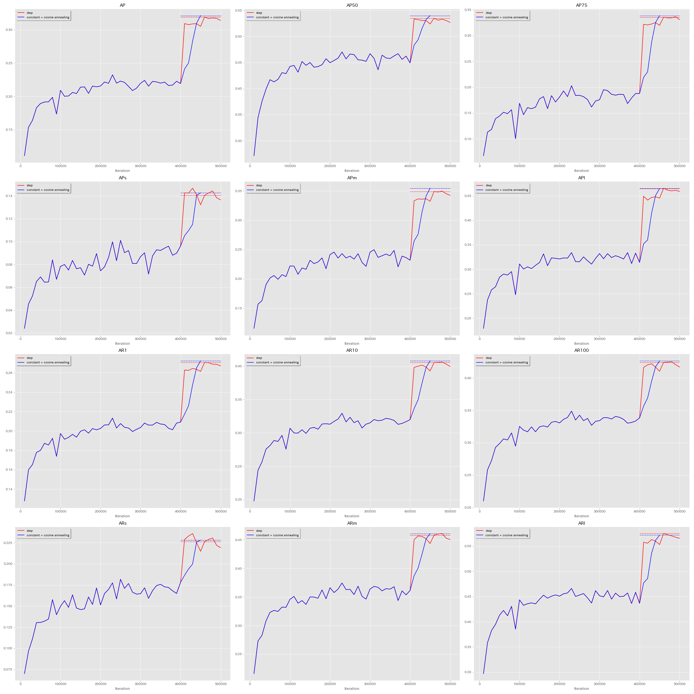
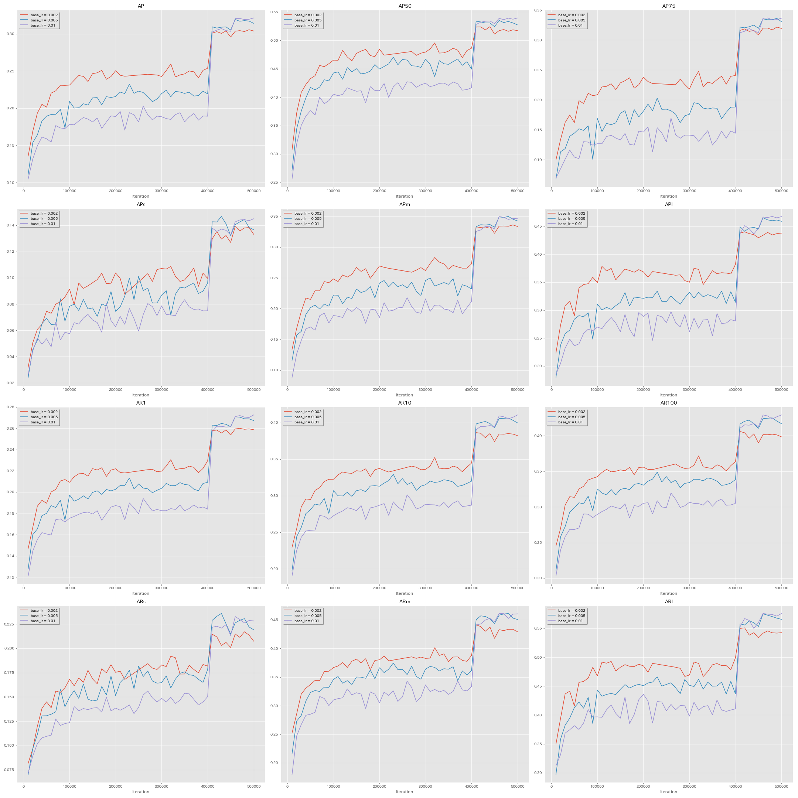
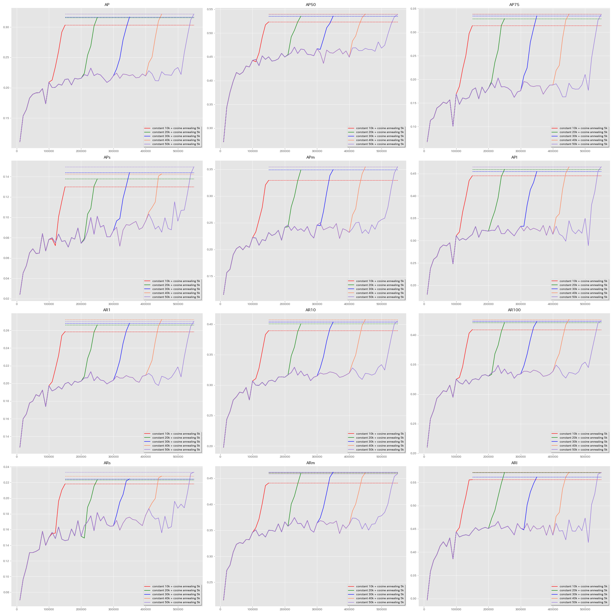

# PyTorch YOLOv3

## Introduction

This is a yet another PyTorch implementation of YOLOv3.

With this repository, you can
* run inference with darknet pretrained models
* train with multiple GPUs
* train with COCO-style datasets
* easily change backbone architecture
* reproduce training results


## Training Results on COCO

| Model                              | Train     | Test     | AP@416 | AP@608 | AP50@416 | AP50@608 |
|:-----------------------------------|:----------|:--------:|:------:|:------:|:--------:|:--------:|
| Paper                              | train+val | test-dev |  31.0  |  33.0  |   55.3   |   57.9   |
| Converted pretrained model         | train2014 | test-dev |  30.5  |  31.9  |   54.4   |   56.5   |
| This repository                    | train2017 | test-dev |  31.8  |  33.3  |   53.5   |   55.8   |
| This repository (cosine annealing) | train2017 | test-dev |  32.0  |  33.7  |   53.7   |   56.2   |

For more detailed experiments, see [this section](#experiments).


## Requirements

* Python 3.6+
* matplotlib
* numpy
* OpenCV
* [pycocotools](https://github.com/cocodataset/cocoapi)
* [tensorboardX](https://github.com/lanpa/tensorboardX) >=1.6
* PyTorch >=1.0.1
* tqdm
* [YACS](https://github.com/rbgirshick/yacs) >=0.1.6


## Installation

### Option 1: Step-by-step installation

```bash
git clone https://github.com/hysts/pytorch_yolov3
cd pytorch_yolov3
pip install cython numpy
python setup.py install
```

### Option 2: Using Docker

You need nvidia-docker2 for this.

#### Build

```bash
docker build . -f docker/Dockerfile -t yolov3
```

#### Run

```bash
docker run --runtime nvidia --ipc host -it yolov3
```


## Inference with pretrained models

### Download darknet pretrained models

Following command downloads pretrained model from
[darknet site](https://pjreddie.com/darknet/yolo/), and convert them to PyTorch
model files this repository uses.

```bash
bash scripts/tools/download_darknet_weights.sh darknet_weights
```

In this repository, images are considered to have BGR channel order,
so we swap channels of the first convolutional layer in darknet pretrained
models, which are trained with images with RGB channel order.

### Run demo

`scripts/demo.py` supports an image input, a video input, and a camera input.
To stop demo, press `q` or `Esc` key on the shown image.

#### On an image

```bash
python scripts/demo.py --ckpt darknet_weights/yolov3.weights.pth --image /path/to/image.jpg
```

#### On an image directory

```bash
python scripts/demo.py --ckpt darknet_weights/yolov3.weights.pth --image_dir /path/to/image/directory
```

To process next image, press any key other than `q` or `Esc`.

#### On a video

```bash
python scripts/demo.py --ckpt darknet_weights/yolov3.weights.pth --video /path/to/video.mp4
```

#### On a webcam

```bash
python scripts/demo.py --ckpt darknet_weights/yolov3.weights.pth --camera
```


## Training

This repository supports training with COCO-style dataset.

### Download COCO 2017 dataset

```bash
bash scripts/tools/download_coco2017.sh ~/datasets/coco2017
```

### Download pretrained backbone model (optional)

You can train YOLOv3 from scratch, but using pretrained backbone weights makes
training faster ([arXiv:1811.08883](https://arxiv.org/abs/1811.08883)).
If you haven't run the script in
[this section](#download-darknet-pretrained-models), run it.

### Write your configuration file

This repository uses [YACS](https://github.com/rbgirshick/yacs) for
configuration.
Default parameters are specified in
[`yolov3/config/defaults.py`](yolov3/config/defaults.py) (which is not
supposed to be modified directly) and you can override them using a YAML file.
All the configurable parameters are listed in
[`configs/yolov3_default.yaml`](configs/yolov3_default.yaml).

You need to create YAML file like that, but you only have to add parameters
you want to override.
For example, if you want to change learning rate,

```yaml
train:
  base_lr: 0.002
```

is enough.

### Training with a single GPU machine

```bash
python scripts/train.py --config /path/to/config/file
```

**Note:** This repository makes it clear not to overwrite output directory
because training object detection model takes so long time that accidentally
corrupting past experiment results is really terrible.
You might find this feature bothersome when you're first trying to run training,
but it's not that bad after all.

### Distributed training with multiple GPUs

This repository supports multi-GPU training with
[`torch.distributed` package](https://pytorch.org/docs/stable/distributed.html).
PyTorch provides `torch.distributed.launch` utility to start multi-GPU
training, and following command is an example to launch training using 8 GPUs.

```bash
python -m torch.distributed.launch --nproc_per_node 8 scripts/train.py --config /path/to/config/file
```

Here, you need to set `train.distributed` in configuration file as follows.

```yaml
train:
  distributed: True
```

**Note:** You could also use `torch.nn.DataParallel` instead of
`torch.nn.parallel.DistributedDataParallel` in this repository, but there's no
reason to use it, as the latter is a lot faster most of the time.

**Note:** Because default parameters specified in
[`yolov3/config/defaults.py`](yolov3/config/defaults.py) are for
single-GPU training, you need to change them in case of multi-GPU training.
If you keep the batch size, you need to raise the learning rate and reduce
the number of iterations. In this case, multiplying learning rate by the number
of GPUs following linear scaling rule
([arXiv:1706.02677](https://arxiv.org/abs/1706.02677), [arXiv:1711.07240](https://arxiv.org/abs/1711.07240)) would be a good idea.
Or, you could divide the batch size by the number of GPUs and reduce
`subdivision` so that `batch_size` / `subdivision` (number of images processed
by each GPU at a time) stays the same.

#### Performance of multi-GPU training


As you can see in the figure above, multi-GPU training brings decent speed-up.
Training YOLOv3 takes quite a long time, but with 8 GPUs (Tesla V100),
training would finish in a few days.

### Resume training

You only need to specify the checkpoint directory with `--resume` option.
Configuration file from checkpoint directory is automatically used and even
if you specify configuration file with `--config` option, it's ignored.

#### In case of single GPU training

```bash
python scripts/train.py --resume /path/to/checkpoint/directory
```

#### In case of multi-GPU training

```bash
python -m torch.distributed.launch --nproc_per_node 8 scripts/train.py --resume /path/to/checkpoint/directory
```

### Restart training from a checkpoint, with different configuration

For this, you just need to specify `train.ckpt_path` in a configuration file,
and run as normal.

```yaml
train:
  ckpt_path: /path/to/checkpoint
```


## Evaluation

No validation is run while training in this repository, so you need to validate
separately.
Validation takes following 2 steps.

### Run prediction on validation dataset

This command runs the model on validation dataset, and saves the detection
results to `predictions.json` in the format that can be fed to COCO API.

```bash
python -u scripts/predict.py --config /path/to/config/file \
                             --ckpt_path /path/to/checkpoint \
                             --outdir /path/to/output/directory
```

### Evaluate detection results using COCO API

This command runs evaluation, saves the results to `stats.json`, and also
reports the results to TensorBoard with a step number specified by
`--step` option.

```bash
python -u ./scripts/evaluate_detection_results.py \
    --gt ~/datasets/coco2017/annotations/instances_val2017.json \
    --pred /path/to/predictions.json \
    --step STEP \
    --outdir /path/to/output/directory
```


## Experiments

### Comparison with converted pretrained model on test-dev

Note that following comparison is not perfectly fair because training data and hyperparameters are not the same.
* Darknet pretrained model uses their own split of COCO, while we use COCO 2017 official train/val split.
* Hyperparameters used for darknet pretrained model is unknown.

| model            | base_lr | schedule        | iter   | size | train     | AP   | AP50 | AP75 | APs  | APm  | APl  | AR1  | AR10 | AR100 | ARs  | ARm  | ARl  |
|:-----------------|:--------|:----------------|:-------|:----:|:----------|:----:|:----:|:----:|:----:|:----:|:----:|:----:|:----:|:-----:|:----:|:----:|:----:|
| Paper            |         | step            |        | 416  | train+val | 31.0 | 55.3 |      |      |      |      |      |      |       |      |      |      |
| pretrained model |         | step            |        | 416  | train2014 | 30.5 | 54.4 | 31.1 | 13.6 | 32.3 | 42.8 | 26.2 | 39.1 | 40.8  | 21.6 | 43.4 | 55.6 |
| this repository  |  0.005  | step            | 460000 | 416  | train2017 | 31.8 | 53.5 | 33.7 | 13.6 | 33.8 | 44.6 | 27.1 | 40.5 | 42.2  | 22.2 | 44.5 | 57.2 |
| this repository  |  0.005  | constant+cosine | 450000 | 416  | train2017 | 32.0 | 53.7 | 33.8 | 13.5 | 33.9 | 44.8 | 27.1 | 40.6 | 42.3  | 22.1 | 44.7 | 57.0 |

| model            | base_lr | schedule        | iter   | size | train     | AP   | AP50 | AP75 | APs  | APm  | APl  | AR1  | AR10 | AR100 | ARs  | ARm  | ARl  |
|:-----------------|:--------|:----------------|:-------|:----:|:----------|:----:|:----:|:----:|:----:|:----:|:----:|:----:|:----:|:-----:|:----:|:----:|:----:|
| Paper            |         | step            |        | 608  | train+val | 33.0 | 57.9 | 34.4 | 18.3 | 35.4 | 41.9 |      |      |       |      |      |      |
| pretrained model |         | step            |        | 608  | train2014 | 31.9 | 56.5 | 33.1 | 17.5 | 34.4 | 40.6 | 27.2 | 41.2 | 43.0  | 26.3 | 45.4 | 54.1 |
| this repository  |  0.005  | step            | 460000 | 608  | train2017 | 33.3 | 55.8 | 35.4 | 18.4 | 36.2 | 40.9 | 27.8 | 42.9 | 44.9  | 28.7 | 46.9 | 54.6 |
| this repository  |  0.005  | constant+cosine | 450000 | 608  | train2017 | 33.7 | 56.2 | 35.8 | 18.6 | 36.6 | 41.1 | 28.0 | 43.1 | 45.2  | 29.1 | 47.5 | 54.9 |


### Changing learning rate scheduling

Cosine annealing ([arXiv:1608.03983](https://arxiv.org/abs/1608.03983)) is effective for object detection too ([arXiv:1809.00778](https://arxiv.org/abs/1809.00778), [arXiv:1902.04103](https://arxiv.org/abs/1902.04103)).

It takes so long to train YOLOv3, so here we train a model using cosine annealing for 50k iterations from the checkpoint trained for 400k iterations with base learning rate.

| base_lr | schedule        | iter   | size | val     | AP   | AP50 | AP75 | APs  | APm  | APl  | AR1  | AR10 | AR100 | ARs  | ARm  | ARl  |
|:--------|:----------------|:-------|:----:|:--------|:----:|:----:|:----:|:----:|:----:|:----:|:----:|:----:|:-----:|:----:|:----:|:----:|
|  0.005  | step            | 460000 | 416  | val2017 | 31.9 | 53.5 | 33.5 | 14.1 | 34.9 | 46.6 | 27.1 | 40.5 | 42.4  | 22.6 | 45.8 | 57.5 |
|  0.005  | constant+cosine | 450000 | 416  | val2017 | 32.1 | 54.0 | 33.8 | 14.3 | 35.5 | 46.5 | 27.2 | 40.8 | 42.6  | 22.8 | 46.1 | 57.2 |

| base_lr | schedule        | iter   | size | val     | AP   | AP50 | AP75 | APs  | APm  | APl  | AR1  | AR10 | AR100 | ARs  | ARm  | ARl  |
|:--------|:----------------|:-------|:----:|:--------|:----:|:----:|:----:|:----:|:----:|:----:|:----:|:----:|:-----:|:----:|:----:|:----:|
|  0.005  | step            | 460000 | 608  | val2017 | 33.3 | 55.6 | 35.5 | 19.1 | 37.4 | 42.6 | 27.6 | 42.8 | 45.1  | 29.9 | 48.0 | 54.9 |
|  0.005  | constant+cosine | 450000 | 608  | val2017 | 34.0 | 56.5 | 36.2 | 20.4 | 37.7 | 43.7 | 28.2 | 43.5 | 45.7  | 31.4 | 48.2 | 56.1 |




### Changing learning rate

| base_lr | schedule | iter   | size | val     | AP   | AP50 | AP75 | APs  | APm  | APl  | AR1  | AR10 | AR100 | ARs  | ARm  | ARl  |
|:--------|:---------|:-------|:----:|:--------|:----:|:----:|:----:|:----:|:----:|:----:|:----:|:----:|:-----:|:----:|:----:|:----:|
|  0.002  | step     | 440000 | 416  | val2017 | 30.4 | 52.4 | 31.6 | 13.2 | 33.3 | 43.5 | 25.8 | 38.5 | 40.3  | 20.6 | 43.8 | 54.3 |
|  0.005  | step     | 460000 | 416  | val2017 | 31.9 | 53.5 | 33.5 | 14.1 | 34.9 | 46.6 | 27.1 | 40.5 | 42.4  | 22.6 | 45.8 | 57.5 |
|  0.01   | step     | 500000 | 416  | val2017 | 32.1 | 53.9 | 33.7 | 14.5 | 34.7 | 46.7 | 27.2 | 41.0 | 42.9  | 22.8 | 46.1 | 57.6 |

| base_lr | schedule | iter   | size | val     | AP   | AP50 | AP75 | APs  | APm  | APl  | AR1  | AR10 | AR100 | ARs  | ARm  | ARl  |
|:--------|:---------|:-------|:----:|:--------|:----:|:----:|:----:|:----:|:----:|:----:|:----:|:----:|:-----:|:----:|:----:|:----:|
|  0.002  | step     | 440000 | 608  | val2017 | 31.4 | 53.6 | 33.2 | 17.8 | 35.1 | 39.6 | 26.2 | 40.3 | 42.5  | 27.5 | 45.3 | 51.2 |
|  0.005  | step     | 460000 | 608  | val2017 | 33.3 | 55.6 | 35.5 | 19.1 | 37.4 | 42.6 | 27.6 | 42.8 | 45.1  | 29.9 | 48.0 | 54.9 |
|  0.01   | step     | 500000 | 608  | val2017 | 33.0 | 55.7 | 34.7 | 19.9 | 37.4 | 41.9 | 27.6 | 42.9 | 45.3  | 30.8 | 48.4 | 54.9 |




### Changing when to decrease learning rate

| base_lr | schedule        | iter_to_start_decay | iter   | size | val     | AP   | AP50 | AP75 | APs  | APm  | APl  | AR1  | AR10 | AR100 | ARs  | ARm  | ARl  |
|:--------|:----------------|:--------------------|:-------|:----:|:--------|:----:|:----:|:----:|:----:|:----:|:----:|:----:|:----:|:-----:|:----:|:----:|:----:|
|  0.005  | constant+cosine |       100000        | 150000 | 416  | val2017 | 30.3 | 52.3 | 31.4 | 13.0 | 32.9 | 44.5 | 25.9 | 39.0 | 40.9  | 21.8 | 44.1 | 55.6 |
|  0.005  | constant+cosine |       200000        | 250000 | 416  | val2017 | 31.6 | 53.5 | 32.9 | 13.8 | 34.9 | 46.0 | 26.6 | 40.1 | 42.1  | 22.4 | 46.0 | 57.2 |
|  0.005  | constant+cosine |       300000        | 350000 | 416  | val2017 | 31.7 | 53.6 | 33.4 | 14.4 | 34.9 | 45.4 | 26.8 | 40.4 | 42.3  | 22.5 | 46.2 | 56.2 |
|  0.005  | constant+cosine |       400000        | 450000 | 416  | val2017 | 32.1 | 54.0 | 33.8 | 14.3 | 35.5 | 46.5 | 27.2 | 40.8 | 42.6  | 22.8 | 46.1 | 57.2 |
|  0.005  | constant+cosine |       500000        | 550000 | 416  | val2017 | 32.2 | 53.9 | 33.8 | 15.0 | 35.5 | 46.5 | 27.0 | 40.5 | 42.4  | 23.3 | 45.9 | 57.1 |




## References

* Redmon, Joseph, Santosh Divvala, Ross Girshick, and Ali Farhadi. "You Only Look Once: Unified, Real-Time Object Detection." The IEEE Conference on Computer Vision and Pattern Recognition (CVPR), 2016. [link](http://openaccess.thecvf.com/content_cvpr_2016/html/Redmon_You_Only_Look_CVPR_2016_paper.html), [arXiv:1506.02640](https://arxiv.org/abs/1506.02640), [Project website](https://pjreddie.com/darknet/yolov1), [GitHub](https://github.com/pjreddie/darknet)
* Redmon, Joseph, and Ali Farhadi. "YOLO9000: Better, Faster, Stronger." The IEEE Conference on Computer Vision and Pattern Recognition (CVPR), 2017. [link](http://openaccess.thecvf.com/content_cvpr_2017/html/Redmon_YOLO9000_Better_Faster_CVPR_2017_paper.html), [arXiv:1612.08242](https://arxiv.org/abs/1612.08242), [Project website](https://pjreddie.com/darknet/yolov2), [GitHub](https://github.com/pjreddie/darknet)
* Redmon, Joseph, and Ali Farhadi. "YOLOv3: An Incremental Improvement." arXiv preprint arXiv:1804.02767 (2018). [arXiv:1804.02767](https://arxiv.org/abs/1804.02767), [Project website](https://pjreddie.com/darknet/yolo), [GitHub](https://github.com/pjreddie/darknet)

* Loshchilov, Ilya, and Frank Hutter. "SGDR: Stochastic Gradient Descent with Warm Restarts." In International Conference on Learning Representations (ICLR), 2017. [link](https://openreview.net/forum?id=Skq89Scxx), [arXiv:1608.03983](https://arxiv.org/abs/1608.03983), [GitHub](https://github.com/loshchil/SGDR)
* Goyal, Priya, Piotr Dollár, Ross Girshick, Pieter Noordhuis, Lukasz Wesolowski, Aapo Kyrola, Andrew Tulloch, Yangqing Jia, and Kaiming He, "Accurate, Large Minibatch SGD: Training ImageNet in 1 Hour." arXiv preprint arXiv:1706.02677 (2017). [arXiv:1706.02677](https://arxiv.org/abs/1706.02677)
* Peng, Chao, Tete Xiao, Zeming Li, Yuning Jiang, Xiangyu Zhang, Kai Jia, Gang Yu, and Jian Sun, "MegDet: A Large Mini-Batch Object Detector." arXiv preprint arXiv:1711.07240 (2017). [arXiv:1711.07240](https://arxiv.org/abs/1711.07240)
* Akiba, Takuya, Tommi Kerola, Yusuke Niitani, Toru Ogawa, Shotaro Sano, and Shuji Suzuki, "PFDet: 2nd Place Solution to Open Images Challenge 2018 Object Detection Track." arXiv preprint arXiv:1809.00778 (2018). [arXiv:1809.00778](https://arxiv.org/abs/1809.00778)
* He, Kaiming, Ross Girshick, and Piotr Dollár, "Rethinking ImageNet Pre-training." arXiv preprint arXiv:1811.08883 (2018). [arXiv:1811.08883](https://arxiv.org/abs/1811.08883)
* Zhang, Zhi, Tong He, Hang Zhang, Zhongyuan Zhang, Junyuan Xie, and Mu Li, "Bag of Freebies for Training Object Detection Neural Networks." arXiv preprint arXiv:1902.04103 (2019). [arXiv:1902.04103](https://arxiv.org/abs/1902.04103)


